# Flydeck Workspace Console

AI programmed agent homeserver interface + workspace tools app

Using Tailscale, NTFY and Codex atm

Your agent should be able to connect it

## Releases

### 13.08.026 10:30 Pre-Release V2 ()

### 11.08.026 19:15 Pre-Release V2 (191e9014c723)
Cache
Keyboard
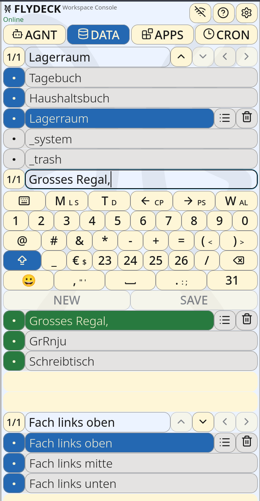

### 08.08.026 14:45 Pre-Release V2 (09c218df5e08)
DATA pretty usable -release

### 06.08.26 18:30 Pre-Release V2 (1cd855ad11be)
DATA/TreeBrowser improvements

### 05.08.26 21:15 Pre-Release V2 (3142011905fb)
New data model with import from V1
Use this client for DATA collection for deep tree lists

### 27.07.26 10:00 Final Release V1

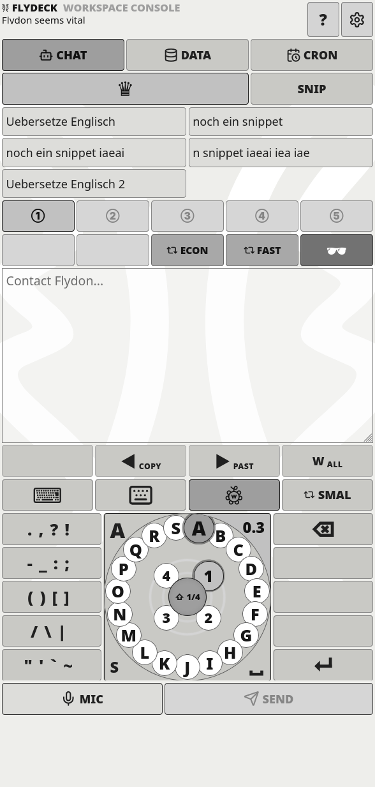
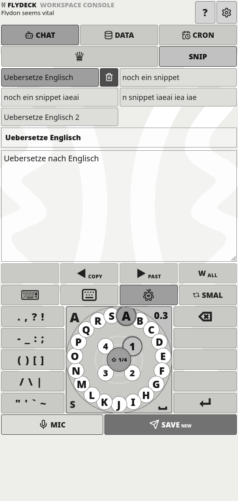
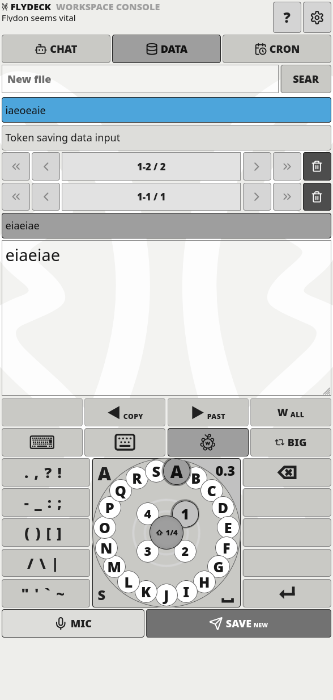
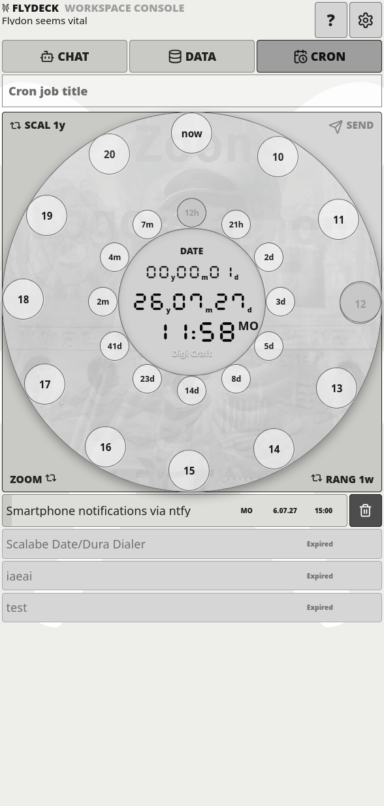
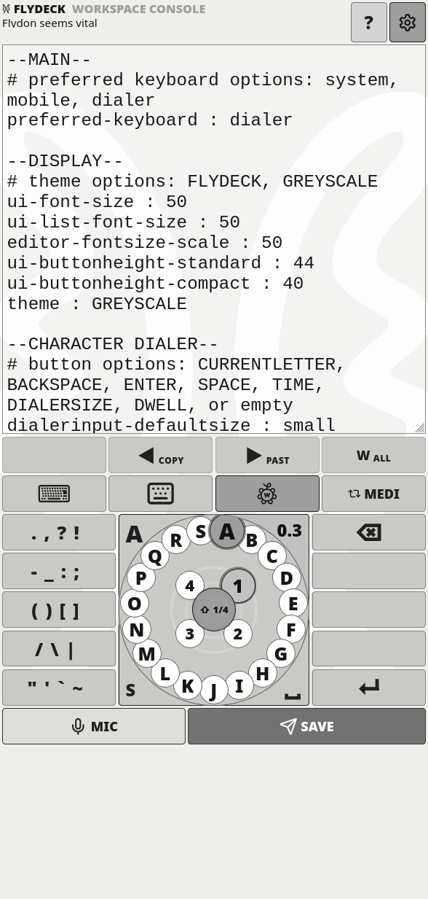
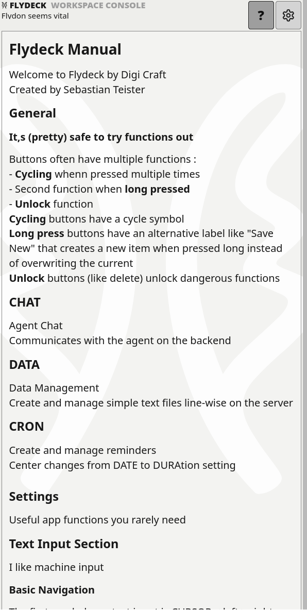

### 26.07.26 17:50 Fixes & Changes

### 23.07.25 13:04 

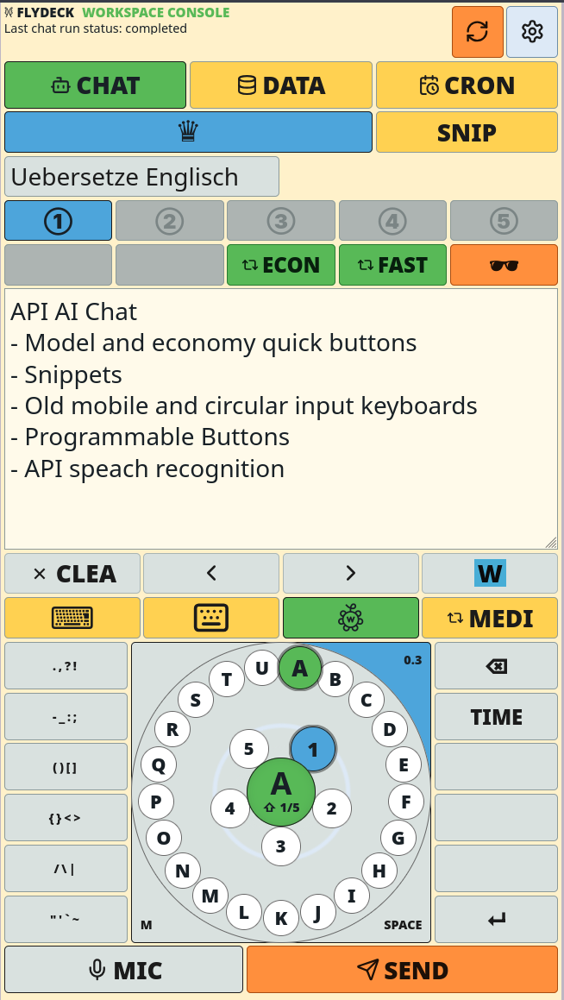
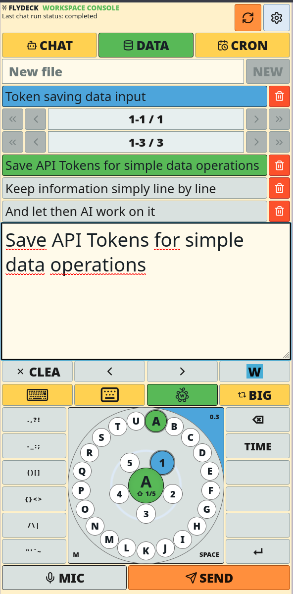
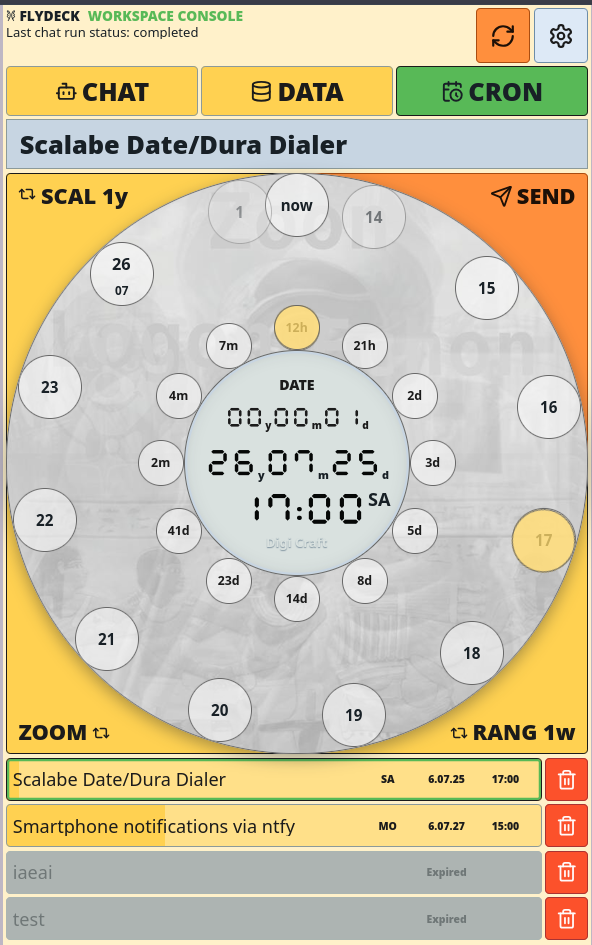
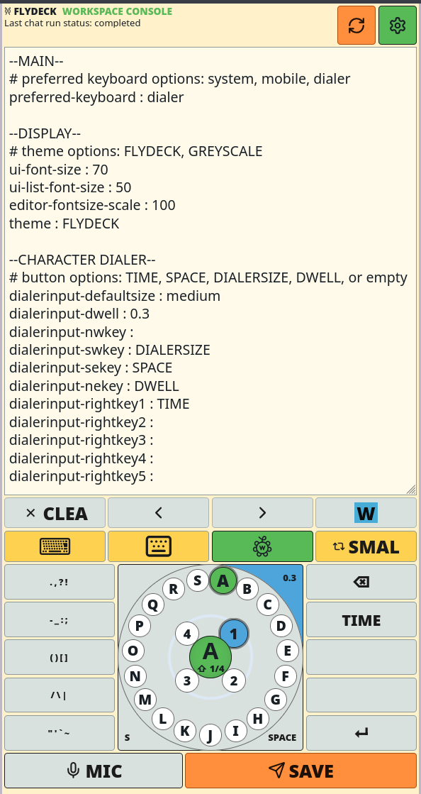
